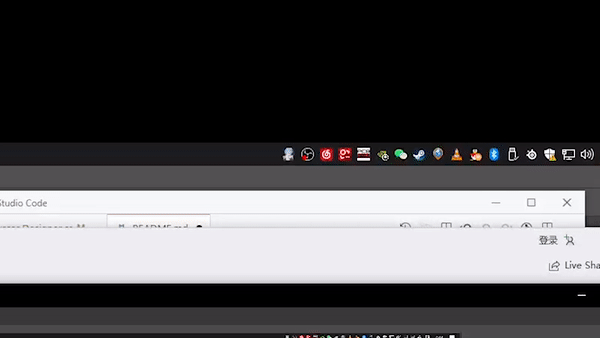

# RunRikka_windows


**Base on RunCat_for_windows from Kyome22. Modified by Karminski-牙医.**


# Tags

`C#` `.NET Core 3.1` `Visual Studio` `RunCat` `RunRikka`

# Demo



**You only have to run the RunRikka.exe**

# Installation

**Access to the "Releases" page and download the RunRikka.exe**

**点击右侧 "Releases" 下载 RunRikka.exe**

# Build Commands

- for .net 5.0 framework installed

```
dotnet publish \
    -r win-x64 \
    -p:PublishSingleFile=true \
    -p:IncludeNativeLibrariesForSelfExtract=false \
    -p:CopyOutputSymbolsToPublishDirectory=false \
    -p:OutputType=WinExe \
    --self-contained=false 

```
 
  
- for self-extract version (.net 5.0 framework dose not installed)

```
dotnet publish \
    -r win-x64 \
    -p:PublishSingleFile=true \
    -p:IncludeNativeLibrariesForSelfExtract=true \
    -p:CopyOutputSymbolsToPublishDirectory=false \
    -p:UseWindowsForms=true \
    -p:NoWin32Manifest=true \
    -p:OutputType=WinExe \
    --self-contained=true 
```

# Contributors

<a href="https://github.com/Kyome22/RunCat_for_windows/graphs/contributors">
  Original RunCat Contributors 
</a>

<!-- Please do not delete the below comment. -->
<!-- CREATED_BY_LEADYOU_README_GENERATOR -->

